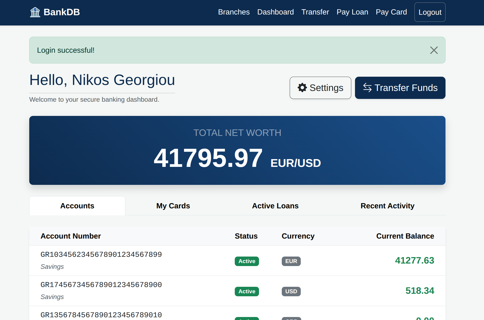

# 🏦 BankDB: Banking Management System Cloud 

## 📌 Project Overview
BankDB is a full-stack banking platform designed for secure and reliable financial management. This repository contains the **Cloud-Optimized version** of the application, configured to run with remote database clusters and production-ready environments.

### 🌐 Live Deployment
The application is fully hosted and accessible online:
👉 **[Live Demo on Render](https://flask-mysql-bank-project.onrender.com/)**

> [!IMPORTANT]
> **Performance Note:** Initial loading may take 30-50 seconds because the application is hosted on Render's free tier, which requires a "spin-up" period after inactivity. The database is securely managed on **Aiven Console**.

---

## 💻 User Interface & Features

#### **Application Dashboard**

* **Dashboard:** View real-time net worth and balances for all linked accounts (Savings, Checking, etc.) dynamically calculated via SQL Views.
* **Secure Login:** Authenticate using a **Customer TIN** (Tax Identification Number).
* **Money Transfer:** Execute secure capital movements between accounts with full ACID reliability.
* **Credit Card Management:** Monitor credit limits and pay off outstanding debt using a synchronized double-transaction strategy.
* **Branch Locator:** Access a complete directory of physical bank branches.
* **Profile Settings:** Dynamically update physical addresses and manage multiple email aliases.

---

## 🏗️ Technical Architecture & Security

### 1. Cloud Database Integration
The system utilizes a remote **MySQL** instance designed in **Third Normal Form (3NF)**.
- **Relational Integrity:** Strict use of Foreign Keys and constraints across 10+ tables.
- **Optimized Retrieval:** Extensive use of SQL Views (e.g., `accounts_balance`) to simplify complex data reporting for the web interface.

### 2. Security & Reliability
- **ACID Transactions:** All financial movements implement `start_transaction()`, `commit()`, and `rollback()` to ensure data integrity in a cloud environment.
- **SQL Injection Protection:** 100% of database interactions utilize **Prepared Statements** to sanitize user input.
- **Production Configuration:** Environment variables are used to manage sensitive database credentials (`DB_HOST`, `DB_USER`, `DB_PASSWORD`), ensuring security on the hosting platform.

---

## 📖 User Manual (Quick Start)

#### **A. Login Credentials**
To explore the application, you can use the following test account:
* **Customer TIN:** `987654321` (User: Nikos Georgiou)
* **Password:** Enter any password (The system currently validates identity via TIN for demonstration purposes).

#### **B. Money Transfer**
1. Navigate to the **Transfer** tab.
2. Select your source account.
3. Enter the recipient's Account Number and the desired amount.
4. The system validates the balance and updates both accounts simultaneously.

#### **C. Managing Debt**
* Use the **Pay Loan** section for installment payments.
* Use **Pay Card** to clear credit card balances; the system will automatically re-adjust your available credit limit.

---

## ⚙️ Technical Implementation Details
* **Backend:** Flask (Python) with `mysql-connector-python`.
* **Frontend:** Responsive design using **Bootstrap 5** and **Jinja2** templates.
* **Deployment:** Automated CI/CD pipeline via GitHub and Render.
